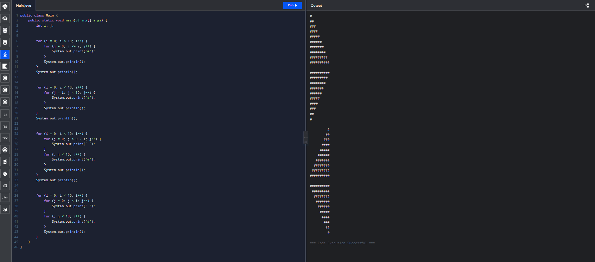
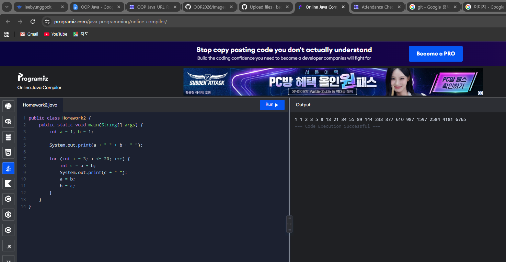

# oop2026
### homework1
```java
public class Main {
    public static void main(String[] args) {
        int i, j;

        for (i = 0; i < 10; i++) {
            for (j = 0; j <= i; j++) {
                System.out.print("#");
            }
            System.out.println();
        }
        System.out.println();

        for (i = 0; i < 10; i++) {
            for (j = i; j < 10; j++) {
                System.out.print("#");
            }
            System.out.println();
        }
        System.out.println();


        for (i = 0; i < 10; i++) {
            for (j = 0; j < 9 - i; j++) {
                System.out.print(" ");
            }
            for (; j < 10; j++) {
                System.out.print("#");
            }
            System.out.println();
        }
        System.out.println();


        for (i = 0; i < 10; i++) {
            for (j = 0; j < i; j++) {
                System.out.print(" ");
            }
            for (; j < 10; j++) {
                System.out.print("#");
            }
            System.out.println();
        }
    }
}
```


### homework2


public class Homework2 {
    public static void main(String[] args) {
        int a = 1, b = 1;

        System.out.print(a + " " + b + " ");

        for (int i = 3; i <= 20; i++) {
            int c = a + b;
            System.out.print(c + " ");
            a = b;
            b = c;
        }
    }
}


### homework3

public class Homework3 {
    public static void main(String[] args) {
        int a = 1, b = 1;

        for (int i = 1; i <= 20; i++) {
            int c = a + b;
            double hw = (double) c / b;

            System.out.println(c + "/" + b + " = " + hw);

            a = b;
            b = c;
        }
    }
}


### homework4

public class Hw {
    public static void main(String[] args) {
        for (int i = 1; i <= 9; i++) {
            for (int j = 1; j <= 9; j++) {
                System.out.print(j + "*" + i + "=" + (j * i) + "\t");
            }
            System.out.println();
        }
    }
}


