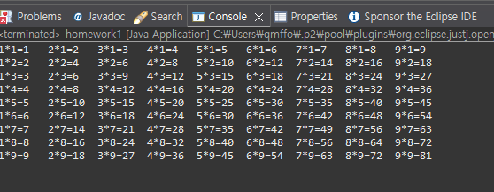
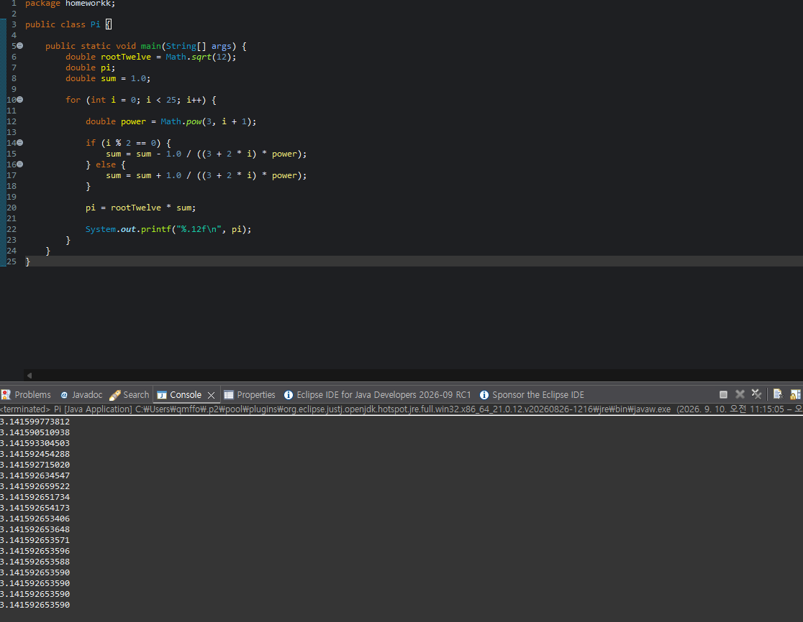
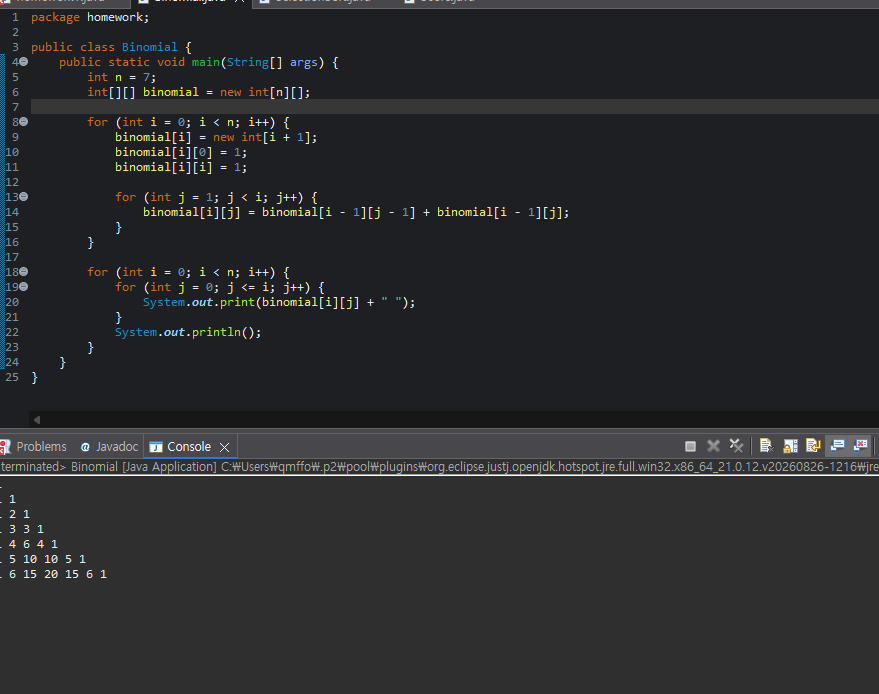
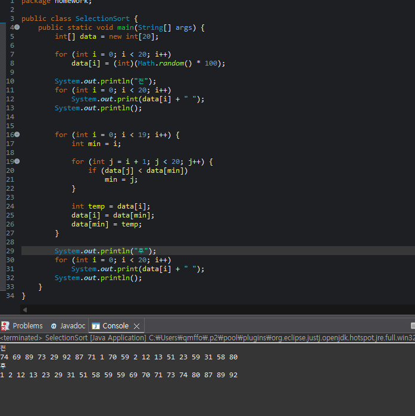
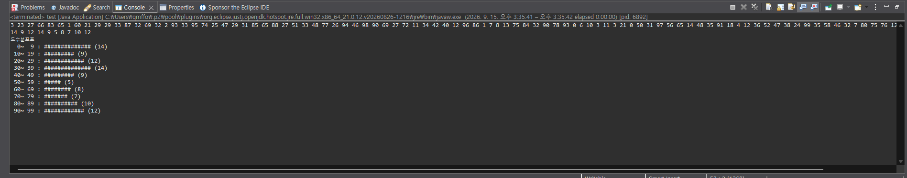
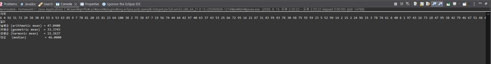

# oop2026
### homework1
```java
public class Main {
    public static void main(String[] args) {
        int i, j;

        for (i = 0; i < 10; i++) {
            for (j = 0; j <= i; j++) {
                System.out.print("#");
            }
            System.out.println();
        }
        System.out.println();

        for (i = 0; i < 10; i++) {
            for (j = i; j < 10; j++) {
                System.out.print("#");
            }
            System.out.println();
        }
        System.out.println();


        for (i = 0; i < 10; i++) {
            for (j = 0; j < 9 - i; j++) {
                System.out.print(" ");
            }
            for (; j < 10; j++) {
                System.out.print("#");
            }
            System.out.println();
        }
        System.out.println();


        for (i = 0; i < 10; i++) {
            for (j = 0; j < i; j++) {
                System.out.print(" ");
            }
            for (; j < 10; j++) {
                System.out.print("#");
            }
            System.out.println();
        }
    }
}
```


### homework2


public class Homework2 {
    public static void main(String[] args) {
        int a = 1, b = 1;

        System.out.print(a + " " + b + " ");

        for (int i = 3; i <= 20; i++) {
            int c = a + b;
            System.out.print(c + " ");
            a = b;
            b = c;
        }
    }
}


### homework3

public class Homework3 {
    public static void main(String[] args) {
        int a = 1, b = 1;

        for (int i = 1; i <= 20; i++) {
            int c = a + b;
            double hw = (double) c / b;

            System.out.println(c + "/" + b + " = " + hw);

            a = b;
            b = c;
        }
    }
}


### homework4

public class homework4 {

    public static void main(String[] args) {
    
        for (int i = 1; i <= 9; i++) {
        
            for (int j = 1; j <= 9; j++) {
            
                System.out.printf("%d*%d=%-4d", j, i, j * i);
                
            }
            
            System.out.println();
        }
        
    }
    
}



### homework5


package homework;


public class Pi {

    public static void main(String[] args) {
        double rootTwelve = Math.sqrt(12);
        double pi;
        double sum = 1.0;

        for (int i = 0; i < 25; i++) {

            double power = Math.pow(3, i + 1);

            if (i % 2 == 0) {
                sum = sum - 1.0 / ((3 + 2 * i) * power);
            } else {
                sum = sum + 1.0 / ((3 + 2 * i) * power);
            }

            pi = rootTwelve * sum;

            System.out.printf("%.12f\n", pi);
        }
    }
}




### homework6

package homework;

public class Binomial {
    public static void main(String[] args) {
        int n = 7;                          
        int[][] binomial = new int[n][];

        for (int i = 0; i < n; i++) {
            binomial[i] = new int[i + 1];  
            binomial[i][0] = 1;
            binomial[i][i] = 1;

            for (int j = 1; j < i; j++) {
                binomial[i][j] = binomial[i - 1][j - 1] + binomial[i - 1][j];
            }
        }

        for (int i = 0; i < n; i++) {
            for (int j = 0; j <= i; j++) {
                System.out.print(binomial[i][j] + " ");
            }
            System.out.println();
        }
    }
}




### homework7

package homework;

public class SelectionSort {
    public static void main(String[] args) {
        int[] data = new int[20];

        for (int i = 0; i < 20; i++)
            data[i] = (int)(Math.random() * 100);

        System.out.println("전");
        for (int i = 0; i < 20; i++)
            System.out.print(data[i] + " ");
        System.out.println();

  
        for (int i = 0; i < 19; i++) {
            int min = i;                        

            for (int j = i + 1; j < 20; j++) {
                if (data[j] < data[min])
                    min = j;                  
            }

            int temp = data[i];              
            data[i] = data[min];
            data[min] = temp;
        }

        System.out.println("후");
        for (int i = 0; i < 20; i++)
            System.out.print(data[i] + " ");
        System.out.println();
    }
}


### homework8

package homework;

public class Score {
    public static void main(String[] args) {
        int student = 30;  
        int subject = 4;   

        int[][] score = new int[student][subject + 1];
   
        for (int i = 0; i < student; i++) {
            int sum = 0;
            for (int j = 0; j < subject; j++) {
                score[i][j] = (int) (Math.random() * 101);  // 0~100
                sum += score[i][j];
            }
            score[i][subject] = sum;
        }

        for (int i = 0; i < student; i++) {
            System.out.print((i + 1) + "\t");
            for (int j = 0; j < score[i].length; j++) {
                System.out.print(score[i][j] + "\t");
            }
            System.out.println();
        }
    }
}


### homework10

package home;

public class test {

	public static void main(String[] args) {

		int array_count, max_value, bin_size, display_scale, hist_size;
		if (args.length != 4)
			return;

		array_count   = Integer.parseInt(args[0]);
		max_value     = Integer.parseInt(args[1]);
		bin_size      = Integer.parseInt(args[2]);
		display_scale = Integer.parseInt(args[3]);
		hist_size     = max_value / bin_size;

		int[] arr = new int[array_count];
		int[] hist = new int[hist_size];

		for (int i = 0; i < array_count; i++) {
			arr[i] = (int) (Math.random() * max_value);
		}

		for (int i = 0; i < array_count; i++) {
			System.out.print(arr[i] + " ");
		}
		System.out.println();

		for (int i = 0; i < array_count; i++) {
			hist[arr[i] / bin_size]++;
		}

		for (int i = 0; i < hist_size; i++) {
			System.out.print(hist[i] + " ");
		}
		System.out.println();

		System.out.println("도수분포표");
		for (int i = 0; i < hist_size; i++) {
			int lower = i * bin_size;
			int upper = lower + bin_size - 1;

			System.out.printf("%3d~%3d : ", lower, upper);

			int barLength = hist[i] / display_scale;
			for (int j = 0; j < barLength; j++) {
				System.out.print("#");
			}

			System.out.println(" (" + hist[i] + ")");
		}
	}
}




### homework11

package home;

public class homework11 {

    public static void main(String[] args) {

        int n = 100;
        int[] data = new int[n];

        for (int i = 0; i < n; i++) {
            data[i] = (int) (Math.random() * 100) + 1;
        }

        System.out.println("무작위");
        for (int i = 0; i < n; i++) {
            System.out.print(data[i] + " ");
        }
        System.out.println();

        double sum = 0;
        for (int i = 0; i < n; i++) {
            sum += data[i];
        }
        double arithmeticMean = sum / n;

        double logSum = 0;
        for (int i = 0; i < n; i++) {
            logSum += Math.log(data[i]);
        }
        double geometricMean = Math.exp(logSum / n);

        double reciprocalSum = 0;
        for (int i = 0; i < n; i++) {
            reciprocalSum += 1.0 / data[i];
        }
        double harmonicMean = n / reciprocalSum;

        int[] sorted = new int[n];
        for (int i = 0; i < n; i++) {
            sorted[i] = data[i];
        }

        for (int i = 0; i < n - 1; i++) {
            for (int j = 0; j < n - 1 - i; j++) {
                if (sorted[j] > sorted[j + 1]) {
                    int temp = sorted[j];
                    sorted[j] = sorted[j + 1];
                    sorted[j + 1] = temp;
                }
            }
        }

        double median;
        if (n % 2 == 0) {
            median = (sorted[n / 2 - 1] + sorted[n / 2]) / 2.0;
        } else {
            median = sorted[n / 2];
        }

        System.out.println(" 결과 ");
        System.out.printf("산술평균 (arithmetic mean) = %.4f%n", arithmeticMean);
        System.out.printf("기하평균 (geometric mean)  = %.4f%n", geometricMean);
        System.out.printf("조화평균 (harmonic mean)   = %.4f%n", harmonicMean);
        System.out.printf("중앙값   (median)          = %.4f%n", median);
    }
}


