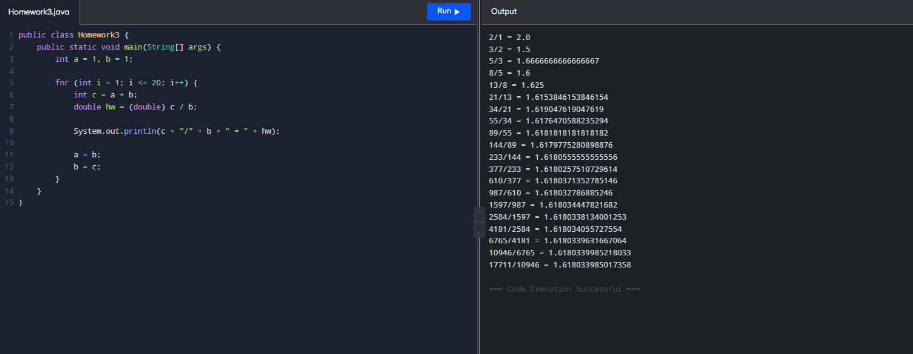

# oop2026
### homework3

public class Homework3 {
    public static void main(String[] args) {
        int a = 1, b = 1;

        for (int i = 1; i <= 20; i++) {
            int c = a + b;
            double hw = (double) c / b;

            System.out.println(c + "/" + b + " = " + hw);

            a = b;
            b = c;
        }
    }
}

