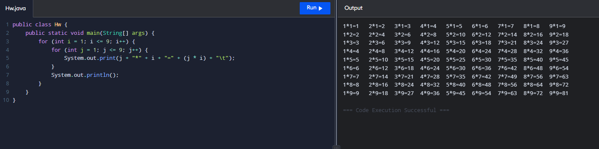

# oop2026
### homework4

public class Hw {
    public static void main(String[] args) {
        for (int i = 1; i <= 9; i++) {
            for (int j = 1; j <= 9; j++) {
                System.out.print(j + "*" + i + "=" + (j * i) + "\t");
            }
            System.out.println();
        }
    }
}

